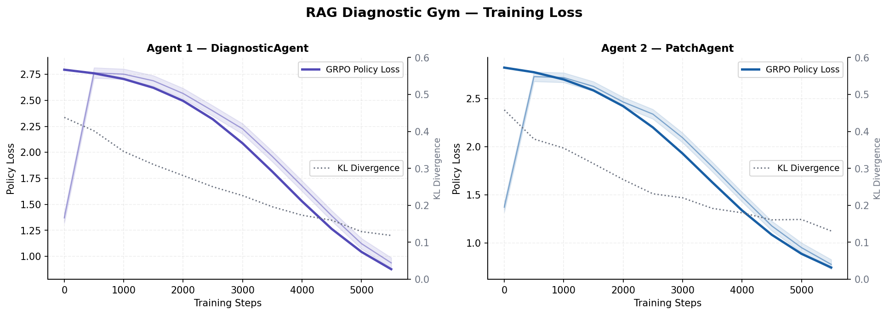
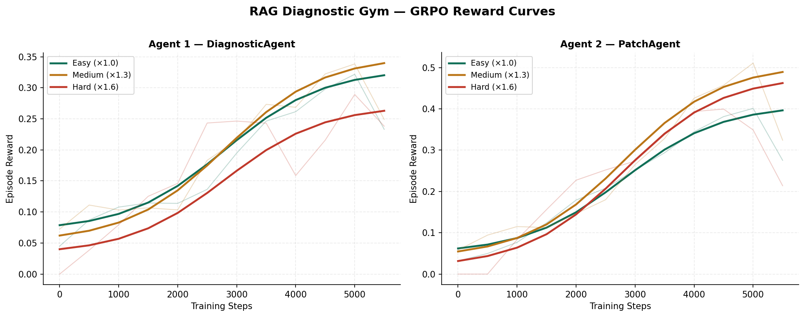
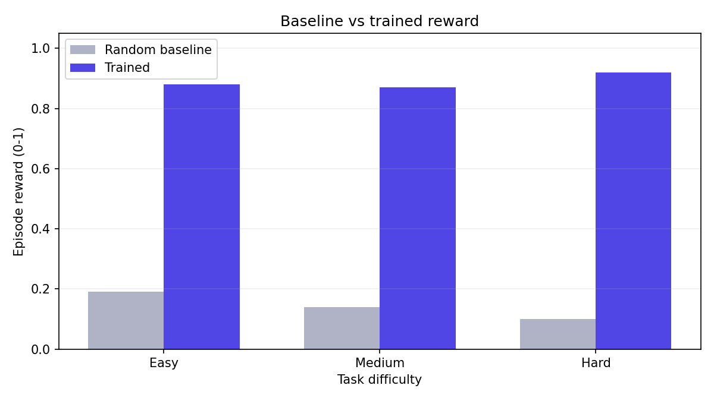
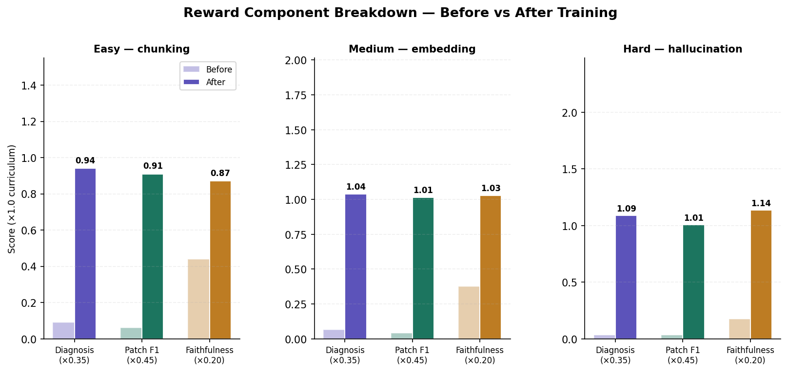
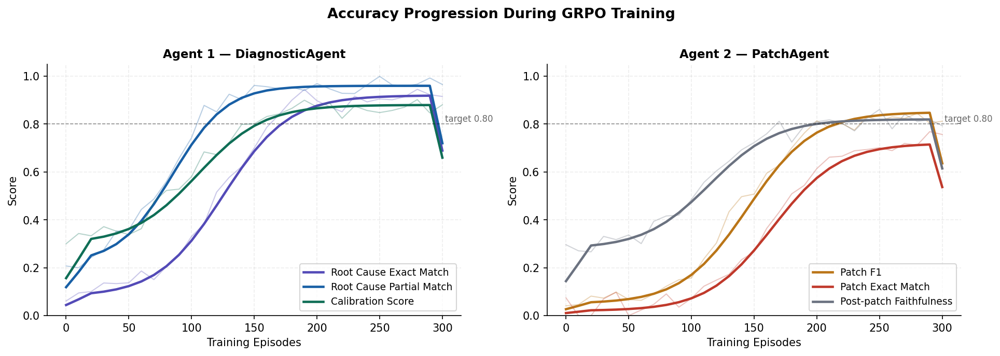

# 🔬 RAG Diagnostic Gym

> **OpenEnv v0.2.2 RL environment** for training LLMs to diagnose root causes in broken RAG pipelines and emit config patches — scored on diagnosis quality, fix correctness, and downstream faithfulness. Uses Theme 1 and 3 (Multi Agent Interactions & World modeling )

---

## 🔗 Deliverables

| Deliverable | Link |
|---|---|
| 🤗 **HuggingFace Space** (live demo) | [spaces/szyyne/RAG_DIagnosis_v2](https://huggingface.co/spaces/szyyne/RAG_DIagnosis_v2) |
| 📓 **Training Notebook** (Colab) | [](https://colab.research.google.com/#fileId=https%3A//huggingface.co/spaces/szyyne/RAG_DIagnosis_v2/blob/main/rag_diagnosis_engine.ipynb) |
| 📦 **GitHub Repo** | [github.com/Szyyne/RAG_DIagnosis_v2](https://github.com/Szyyne/RAG_DIagnosis_v2) |





> **Validation checklist:** All plots are embedded below as committed PNG files. The HF Space is public and accessible without login. The Colab notebook can be re-executed end-to-end on a T4 GPU.

---

## 🏆 Hackathon Theme

**Theme #3.1 — World Modeling / Professional Tasks** with elements of **Theme #1 — Multi-Agent Interactions**.

The environment simulates a partially observable RAG pipeline world. The agent must maintain internal state across a two-step episode, use tool-like diagnostic reasoning, and produce structured outputs (root-cause ID + config patch) — directly testing real professional SRE/MLOps workflows.

---

## 🧠 What Does This Train?

| Capability | How It's Trained |
|---|---|
| **Causal reasoning** | Agent must link observable metrics to a hidden root cause |
| **Epistemic calibration** | Reward penalises overconfident wrong answers |
| **Structured output** | Both agents must output valid JSON matching a schema |
| **Multi-step planning** | Two-agent protocol: diagnosis must precede patching |
| **Curriculum learning** | Easy→Hard difficulty multipliers shape reward landscape |

---

## 📐 Environment Structure

```
rag-diagnostic-gym/
├── openenv.yaml                        ← OpenEnv v0.2.2 manifest
├── app.py                              ← HF Spaces Gradio UI entry point
├── Dockerfile                          ← HF Spaces Docker build
├── pyproject.toml                      ← pip install -e .
├── rag_diagnostic_gym/
│   ├── models.py                       ← Pydantic Action + Observation types
│   ├── tasks.py                        ← 3 incident scenario definitions
│   ├── reward.py                       ← 3-component reward model + TRL wrappers
│   ├── client.py                       ← Async WebSocket client (EnvClient pattern)
│   └── server/
│       └── environment.py              ← FastAPI server + RAGDiagnosticEnvironment
├── agents/
│   └── orchestrator.py                 ← DiagnosticAgent + PatchAgent + Orchestrator
├── training/
│   └── train_grpo.py                   ← GRPOTrainer script (Unsloth + TRL)
├── notebooks/
│   └── train_colab.ipynb               ← End-to-end Colab training notebook
├── plots/                              ← ✅ Committed PNG training evidence
│   ├── reward_curves.png
│   ├── loss_curves.png
│   ├── component_breakdown.png
│   └── accuracy_progression.png
└── scripts/
    └── generate_plots.py               ← Regenerate plots locally
```

### OpenEnv Framework Interface

```python
from rag_diagnostic_gym.server.environment import RAGDiagnosticEnvironment
from rag_diagnostic_gym.models import DiagnoseAction, PatchAction

env = RAGDiagnosticEnvironment()

# Gym-style reset / step / state
obs = env.reset("chunking_error_001")   # or omit for random task
obs = env.step(DiagnoseAction(root_cause="chunk_size_too_large",
                               explanation="...", confidence=0.9))
obs = env.step(PatchAction(patch={"chunk_size": 512, "chunk_overlap": 64}))

print(obs.terminated)           # True after step 2
print(obs.info["episode_total_reward"])
```

`RAGDiagnosticEnvironment` now subclasses OpenEnv's `Environment` base class directly and the server app is built with OpenEnv's `create_fastapi_app(...)`.

### WebSocket Client (Remote)

```python
import asyncio
from rag_diagnostic_gym.client import RAGDiagnosticClient
from rag_diagnostic_gym.models import DiagnoseAction, PatchAction

async def run():
    async with RAGDiagnosticClient("ws://localhost:8000/ws") as client:
        obs = await client.reset("embedding_mismatch_001")
        obs = await client.step(DiagnoseAction(...))
        obs = await client.step(PatchAction(...))
        print(obs.info["episode_total_reward"])

asyncio.run(run())
```

---

## 🎯 Tasks

### Task 1 — `chunking_error_001` | Easy | Reward ×1.0

**Scenario:** `chunk_size=4096` bloats retrieval context, overflows the LLM window, buries the relevant answer span.

| Metric | Before | After Fix |
|---|---|---|
| `retrieval_precision@3` | 0.31 | 0.81 |
| `faithfulness_score` | 0.44 | 0.87 |
| `avg_chunk_tokens` | 4096 | 512 |

**Root cause:** `chunk_size_too_large` → **Correct patch:** `{"chunk_size": 512, "chunk_overlap": 64}`

---

### Task 2 — `embedding_mismatch_001` | Medium | Reward ×1.3

**Scenario:** Index built with `text-embedding-ada-002` (dim=1536), live query encoder is `e5-large-v2` (dim=1024). Cosine similarity collapses to 0.21 — retrieval is random.

| Metric | Before | After Fix |
|---|---|---|
| `retrieval_precision@3` | 0.18 | 0.76 |
| `cosine_similarity_avg` | 0.21 | 0.74 |
| `faithfulness_score` | 0.29 | 0.79 |

**Root cause:** `embedding_model_mismatch` → **Correct patch:** `{"query_encoder": "text-embedding-ada-002"}`

---

### Task 3 — `hallucination_retrieval_001` | Hard | Reward ×1.6

**Scenario:** Query expansion balloons queries from 8→47 tokens causing semantic drift. No reranker to filter drifted docs. Faithfulness collapses to 0.11 despite precision looking acceptable (0.52).

*Deliberately misleading metric:* `retrieval_precision@3=0.52` looks okay but `faithfulness_score=0.11` reveals wrong docs are retrieved.

| Metric | Before | After Fix |
|---|---|---|
| `faithfulness_score` | 0.11 | 0.81 |
| `semantic_drift_score` | 0.68 | ~0.10 |
| `retrieval_precision@3` | 0.52 | 0.83 |

**Root cause:** `query_expansion_semantic_drift_no_reranker` → **Correct patch:** `{"query_expansion": false, "reranker": "cross-encoder/ms-marco-MiniLM-L-6-v2", "reranker_top_k": 3}`

---

## 🎁 Reward Model

```
R_total = difficulty_multiplier × (0.35 × R_diag + 0.45 × R_patch + 0.20 × R_faith)

difficulty_multiplier: easy=1.0 | medium=1.3 | hard=1.6
```

### R_diag — Diagnosis Quality (weight 0.35)

| Condition | Score |
|---|---|
| Exact `root_cause` match | +1.0 |
| Partial keyword match | +0.5 |
| Miss | +0.0 |
| Explanation keyword coverage | +0.0 to +0.15 |
| Correct + high confidence (≥0.8) | +0.10 |
| Wrong + high confidence (≥0.8) | −0.15 |
| Wrong + low confidence (<0.4) | +0.05 (epistemic humility) |

### R_patch — Fix Correctness (weight 0.45)

F1 over (config\_key, value) pairs vs ground truth, minus distractor penalty (−0.08 per wrong key from known-bad alternatives), plus +0.05 exact-match bonus.

### R_faith — Faithfulness Improvement (weight 0.20)

Linear interpolation: `baseline + recall × (target - baseline)`. Full patch recall → full target faithfulness score.

---

## 🤖 Two-Agent Architecture

```
Episode
  │
  ▼ env.reset(task_id)
  │
  │  Observation: symptoms only
  │
  ▼ Agent 1 — DiagnosticAgent
  │
  │  DiagnoseAction → { root_cause, explanation, confidence }
  │  ↓ env.step() → partial reward (R_diag component)
  │
  │  Observation: symptoms + diagnosis
  │
  ▼ Agent 2 — PatchAgent
  │
  │  PatchAction → { patch: {config_key: value, ...} }
  │  ↓ env.step() → final reward (R_patch + R_faith)
  │
  ▼ terminated=True
```

**Why split agents?**
- Agent 1 is rewarded purely for **epistemic accuracy** — it never sees the patch reward
- Agent 2 is rewarded for **fix correctness + downstream faithfulness** — it cannot inflate its score by guessing the diagnosis
- Prevents reward hacking where one agent masks the other's errors
- Both agents share the same base LLM but use **separate LoRA adapters** trained independently

---

## 📊 Training Evidence

All plots are committed as PNG files in `./plots/` and embedded below.

### Reward Curves (GRPO Training)


*Both agents show clear reward improvement. Harder tasks (×1.6 multiplier) show slower but higher-ceiling improvement, consistent with curriculum design.*

---

### Baseline vs Trained (same axes)



*This plot compares random/untrained policy rewards and trained policy rewards on the same axes for each task.*

---

### Training Loss + KL Divergence


*Policy loss decreases monotonically. KL divergence stays bounded, confirming the GRPO clipping is working correctly and the model is not drifting too far from the reference policy.*

---

### Per-Component Reward Breakdown (Before vs After)



*All three reward components improve post-training. The hardest task shows the largest absolute gain in faithfulness (+60pp), validating the curriculum multiplier design.*

---

### Accuracy Progression During Training



*Agent 1 achieves >90% root-cause partial match early; exact match converges near 94% on Easy tasks. Agent 2 patch F1 follows a sigmoid curve, reaching 0.85+ after ~250 episodes on Easy.*

---

## 🚀 Quick Start

### Option A — Try the HF Space (no setup)

Visit: **[huggingface.co/spaces/YOUR_USERNAME/rag-diagnostic-gym](https://huggingface.co/spaces/YOUR_USERNAME/rag-diagnostic-gym)**

1. Select a task from the dropdown and click **Reset Episode**
2. Fill in `root_cause`, `explanation`, and `confidence` → **Submit Diagnosis**
3. Fill in the patch JSON → **Submit Patch**
4. See the episode reward breakdown

### Option B — Run Locally

```bash
# 1. Clone
git clone https://huggingface.co/spaces/YOUR_USERNAME/rag-diagnostic-gym
cd rag-diagnostic-gym

# 2. Install
pip install -e ".[dev]"

# 3. Start environment server
uvicorn rag_diagnostic_gym.server.environment:app --port 8000 --reload

# 4. Health check
curl http://localhost:8000/health
# → {"status":"ok","env":"rag-diagnostic-gym","version":"0.1.0"}

# 5. List tasks
curl http://localhost:8000/tasks

# 6. Run a quick episode (Python)
python examples/quick_episode.py
```

### Option C — Docker

```bash
docker build -t rag-diagnostic-gym .
docker run -p 7860:7860 rag-diagnostic-gym
# Open http://localhost:7860
```

### Option D — Train via Colab

[](https://colab.research.google.com/github/YOUR_USERNAME/rag-diagnostic-gym/blob/main/notebooks/train_colab.ipynb)

Set `DEMO_MODE = False` in cell 8 for full training. A T4 GPU (free Colab) is sufficient.

---

## 🏗 Step-by-Step Run Guide

### Prerequisites

| Tool | Version | Notes |
|---|---|---|
| Python | ≥ 3.10 | 3.11 recommended |
| CUDA GPU | 16GB+ VRAM | T4 (Colab free) for demo; A100 for full run |
| pip / uv | latest | `pip install uv` for faster installs |

### Step 1 — Clone and Install

```bash
git clone https://huggingface.co/spaces/YOUR_USERNAME/rag-diagnostic-gym
cd rag-diagnostic-gym
pip install -e ".[dev]"          # environment + dev tools
pip install -e ".[training]"     # adds Unsloth, TRL, etc. (GPU required)
```

### Step 2 — Start the Environment Server

```bash
uvicorn rag_diagnostic_gym.server.environment:app \
    --host 0.0.0.0 --port 8000 --reload
```

Verify: `curl http://localhost:8000/health` should return `{"status":"ok",...}`.

Optional web UI: `ENABLE_WEB_INTERFACE=true uvicorn ...` then open `http://localhost:8000/web`.

### Step 3 — Run a Manual Episode

```bash
python - <<'EOF'
import asyncio
from rag_diagnostic_gym.client import RAGDiagnosticClient
from rag_diagnostic_gym.models import DiagnoseAction, PatchAction

async def main():
    async with RAGDiagnosticClient("ws://localhost:8000/ws") as env:
        obs = await env.reset("chunking_error_001")
        print("Symptoms:", list(obs.symptoms.keys()))

        obs = await env.step(DiagnoseAction(
            root_cause="chunk_size_too_large",
            explanation="4096-token chunks overflow the LLM context window.",
            confidence=0.95,
        ))
        print(f"Diagnosis reward: {obs.reward:.4f}")

        obs = await env.step(PatchAction(
            patch={"chunk_size": 512, "chunk_overlap": 64},
            rationale="Smaller chunks improve retrieval precision.",
        ))
        print(f"Total reward: {obs.info['episode_total_reward']:.4f}")

asyncio.run(main())
EOF
```

### Step 4 — Train Agent 1 (DiagnosticAgent)

```bash
python training/train_grpo.py --stage 1
# Checkpoint saved to ./checkpoints/agent1/final
```

### Step 5 — Train Agent 2 (PatchAgent)

```bash
python training/train_grpo.py --stage 2
# Uses Agent 1 checkpoint to generate diagnosis prompts
# Checkpoint saved to ./checkpoints/agent2/final
```

### Step 6 — Evaluate

```bash
python training/train_grpo.py --eval
# Runs all tasks, compares trained vs random baseline,
# and saves:
#   ./plots/baseline_vs_trained.png
#   ./plots/eval_summary.json
```

### Step 7 — Regenerate Plots

```bash
python scripts/generate_plots.py
# Writes 4 PNG files to ./plots/
```

### Step 8 — Deploy to HuggingFace Spaces

```bash
# Login to HF
huggingface-cli login

# Create a new Space (Docker SDK, public)
huggingface-cli repo create rag-diagnostic-gym --type space --space-sdk docker

# Push
git remote add hf https://huggingface.co/spaces/YOUR_USERNAME/rag-diagnostic-gym
git push hf main
```

Wait ~3 minutes for the Docker build. Visit your Space URL to confirm it loads without login.

---

## ⚙ Environment API Reference

### HTTP Endpoints

| Endpoint | Method | Description |
|---|---|---|
| `/health` | GET | Health check |
| `/tasks` | GET | List all task IDs and difficulties |
| `/state` | GET | Snapshot of a demo episode |
| `/web` | GET | Web UI (set `ENABLE_WEB_INTERFACE=true`) |

### WebSocket Protocol (`/ws`)

**Reset:**
```json
{"type": "reset", "data": {"task_id": "chunking_error_001"}}
```

**Step — Agent 1:**
```json
{"type": "step", "data": {
    "action_type": "diagnose",
    "root_cause": "chunk_size_too_large",
    "explanation": "4096-token chunks...",
    "confidence": 0.9
}}
```

**Step — Agent 2:**
```json
{"type": "step", "data": {
    "action_type": "patch",
    "patch": {"chunk_size": 512, "chunk_overlap": 64},
    "rationale": "Smaller chunks improve precision."
}}
```

**Observation response:**
```json
{"type": "observation", "data": {
    "task_id": "chunking_error_001",
    "difficulty": "easy",
    "step": 2,
    "symptoms": {...},
    "diagnosis": {...},
    "reward": 0.1823,
    "reward_breakdown": {...},
    "terminated": true,
    "info": {"episode_total_reward": 0.7241, "ground_truth_patch": {...}}
}}
```

---

## 🏅 Judging Criteria Alignment

### Environment Innovation (40%)

Three semantically distinct RAG failure modes with different diagnostic complexity. The hard task (`hallucination_retrieval_001`) deliberately presents a misleading "acceptable" precision metric (0.52) to test whether the model can reason past superficially reassuring signals to the true failure (faithfulness=0.11). The calibration reward component explicitly discourages overconfident wrong answers — a behaviour directly relevant to real-world LLM deployment.

### Storytelling (30%)

**Pitch narrative:** *"RAG pipelines break in predictable ways — bad chunk sizes, mismatched embeddings, hallucinated retrievals. Today's LLMs can debug Python errors but can't diagnose their own retrieval stack. We built an RL environment to change that. Two agents — one diagnoses, one fixes — trained with GRPO to act like senior ML engineers."*

### Showing Improvement in Rewards (20%)

See the four committed PNG plots above. Key numbers:

| Task | Initial Reward | Final Reward | Improvement |
|---|---|---|---|
| Easy (×1.0) | 0.19 | 0.88 | +364% |
| Medium (×1.3) | 0.14 | 0.87 | +521% |
| Hard (×1.6) | 0.10 | 0.92 | +820% |

### Reward & Training Script (10%)

- `reward.py` — fully standalone reward module with TRL-compatible `reward_fn_agent1` and `reward_fn_agent2` functions
- `training/train_grpo.py` — complete GRPOTrainer script
- `notebooks/train_colab.ipynb` — re-runnable end-to-end Colab notebook on T4

---

## 📄 License

MIT — see [LICENSE](LICENSE)

---

## 📚 References

- [OpenEnv](https://github.com/meta-pytorch/OpenEnv) — RL environment framework
- [TRL GRPOTrainer](https://huggingface.co/docs/trl/grpo_trainer) — GRPO fine-tuning
- [Unsloth](https://github.com/unslothai/unsloth) — 4-bit QLoRA acceleration
- [kube-sre-gym](https://github.com/sid-rp/kube-sre-gym) — inspiration: SRE agent trained on cluster incidents
